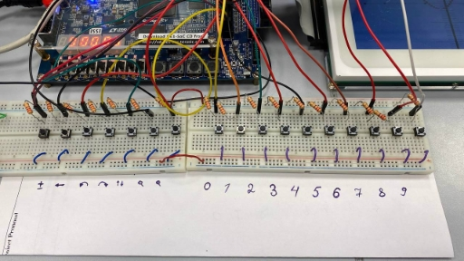
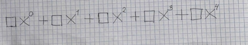
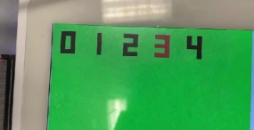
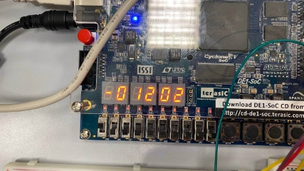
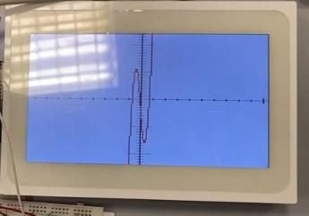
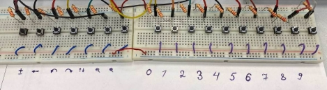
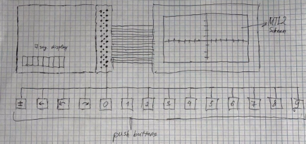

Digital polynomial graph maker

Alikhan Baidussenov1, Sanzhar Mazhit2, Yeldar Kakimbek[^1]

Lab Section 5

1 alikhan.baidussenov@nu.edu.kz 2 sanzhar.mazhit@nu.edu.kz

3 yeldar.kakimbek@nu.edu.kz

1  Introduction

The project was dedicated to construct a tool that draws an inputted polynomial equation as a graph. The tool consists of a custom keyboard on a breadboard connected to an FPGA with an MTL2 screen. It took learning to work with Verilog modules and electronic circuits in regular weekly lab sessions, as well to organize general-purpose input/output (GPIO) ports during the sessions of independent work. This project was important for developing coding skills, especially for hardware.

2  Materials and Methods
1. 2 breadboards to serve as the keyboard base.
1. 1 Altera DE1-SOC FPGA Board to serve as the processing unit.
1. 1 Multi-Touch LCD Modules 2nd Edition MTL2 to serve as the screen.
1. 17 Push-Buttons for inputting.
1. Dupont wires: M-to-M for intra-keyboard connections and M-to-F for extra-keyboard connections with the processing unit.
1. 1K Ohm resistors for stabilizing the push-buttons’ voltage.

Figure 2: The real implementation of the project from the user perspective

Interaction with the screen goes through the use of buttons on the breadboard. There are 17 buttons for different purposes. 7 them for sign change, delete the numbers (backspace button), shift left and shift right buttons, mode change, zoom in and zoom out buttons. Other 10 buttons for integer input.

Figure 3: Coefficient assigning method for 4th degree polynomial

To assign the coefficient in front of the variable with the respective degree, the user should choose the digit, which represents the degree of the variable. Note that initially all the coefficients are equal to 0.

Figure 4: Degree choosing mode. Red colored one is currently chosen degree of the variable

After choosing the right degree, to put the coefficients, the user should press buttons representing the digits. After pressing them, user can see the number on the 7 segment displays as shown in Figure 5. User can change the sign if it is needed.

Figure 5: Chosen number on the 7 segment displays

After choosing coefficients for all the variables user can press ‘mode change’ button to see the result. The result will be displayed on the MTL2 screen as shown in Figure 6.

Figure 6: The result from the user perspective

To see more clear image user can press ‘zoom in’ or ‘zoom out’ buttons. Also to change the view user can press ‘shift left’ and ‘shift right’ buttons as well.

Link to the user experience video is [here](https://drive.google.com/file/d/1OOdgRi6XGyOKNpfXB-3CYShodbOHhODp/view?usp=sharing)

3\.1 Description of work

The system consists of three main components, which can be separated as the input unit (keyboard), the processing block (FPGA), and the output unit (MTL2 screen and 7 segment displays on the FPGA). The output units were already working devices, so we will describe the other two components.

1. Input

Figure 7: Input buttons on the breadboard

The keyboard is simply a circuit with a set of 17 push buttons and resistors connected in parallel. The potential difference is created by the 5V and GND (ground) ports among the GPIO ports of the FPGA. Each button is connected to a corresponding GPIO port, which is always ready to receive signals.

2. Processing unit

The main purpose of the processing unit is sustaining synchronization between the user’s inputs and the outputting image. Here are the steps we took for its implementation:

1. Each port used was stored in a variable in the pin assignment file called GraphCalc.qsf. We took a pin provided during our lab sessions ([1]) for accessing GPIOs, but also included all the LED ports of each 7 segment display.
1. Each value necessary to output a number was handled as a state; each value is a variable with allocated memory (up to 36 bits). The states are the digits of the currently inputting number and its sign.
1. Each state is synchronized with a corresponding 7 segment display via external modules called dec~~ to~~ 7seg and sign~~ to~~ 7seg. The modules are implemented in .v files with the same names. Executing every time the clock pin becomes HIGH, they convert the inputted values to 7 bits that are recognized by the 7 segment displays. Then the 7 bit values are outputted to the 7 segment display ports prepared in the pin assignment in step 1. Thus whenever a state changes, the corresponding 7 segment display immediately shows it.
1. Since GPIO input ports are already constantly in sync with the incoming signals, it was enough to store their values in wire variables to make states out of them. However, when buttons were pressed, bounces occurred. To solve this problem, we used the Pushbutton~~ Debounce module ([2]). It denounces and synchronizes the inputting signals with the clock pin via double flip-flops.
5. Now all that was left was to calculate the outputting states’ values whenever the inputting states were changed (the user inputs anything). For example, whenever the user switches between the coefficients (pressing 5th button in Picture 1), change the values of the states that are in sync with 7 segment displays to corresponding coefficient’s value.
4  [Software](https://github.com/tsl-robt/graph-calculator/tree/main)

sign~~ to~~ 7seg module:

Converts the given sign state’s value into a 7 bit value that draws the corresponding sign in the given 7 segment display. dec~~ to~~ 7seg works similarly.

Input: clock and sign (positive or negative).

Output: hex (encoded LED segments of 7 segment display).

|
function sign to 7seg module

Initialize hex encoding as empty 7 bit binary for every clock rise do

if sign == 0 then

Set hex = 7’b0111111

else

Set hex = 7’b1111111

end if end for

end function
|
| - |
|
Pushbutton~~ Debouncer module:

Debounces the inputting button signal and limits its duration up to 1 clock cycle so that button hold is considered as a single click. The code simulates a double flip-flop.

Input: clock and btn (button signal).

Output: btn~~ up (single clock signal when button is pressed).
|
|
function Pushbutton Debouncer module

Initialize hex encoding as empty 7 bit binary

for every clock rise do

Set btn~~ sync~~ 0 = not btn

end for

for every clock rise do

Set btn~~ sync~~ 1 = btn~~ sync~~ 0

end for

Set btn~~ cnt = empty 16 bit value.

Set btn~~ idle = btn~~ state == btn~~ sync~~ 1.

Set btn~~ cnt~~ max = & btn~~ cnt.

for every clock rise do

if btn~~ idle then

Set btn~~ cnt = 0

else

Increment btn~~ cnt

if btn~~ cnt~~ max then

Set btn~~ state = not btn~~ state.

end if

end if

end for

assign PB~~ down = PB~~ idle & PB~~ cnt~~ max & PB~~ state;

assign PB~~ up = PB~~ idle & PB~~ cnt~~ max & PB~~ state; end function
|
|
poly() function:

This function calculates the value of a polynomial given the argument and coefficients. Formula uses a minimal number of operations without calculating every power of x.

Input: x, five coefficients of polynomial a4, a3, a2, a1, a0

Output: value of polynomial at x
|
|
function poly(x, a4, a3, a2, a1, a0)

Set poly as ((((a4 \* x + a3) \* x) + a2) \* x + a1)\*x + a0 end function
|

inp~~ handler (MAIN) module:

Main module. Every block is explained in comments.

function inp handler module

Initialize all variables used

Set graph = 0 ▷Boolean value whether to show input menu or the graph Set curCoef = 0 ▷Current coefficient to input, values from 0 to 4 Set zoom = 1 ▷Stretch x axis by zoom. Values are 1, 2, 4, 8 Set shiftX = 400

Set shiftY = 240 ▷These values are used to get values of x and y from values of hpos and vpos Set plus = 1 ▷Boolean value that stores the sign of current coefficient for i from 0 to 35 do

Generate PushButton~~ Debouncer for every pin in GPIO~~ 0

▷pressed[i] is 1 means i-th pin was pressed.

end for

for every clock rise do

Set x = (hpos - shiftX) / zoom

Set y = shiftY - vpos

Set Color of current pixel to white

if Switch mode button was pressed then

Save currently inputted coefficient in coefs

Save sign of coefficient by multiplying

Change boolean value of graph

end if

if graph then

if Left button was pressed then

Increment shiftX by 10

end if

if Right button was pressed then

Decrement shiftX by 10

end if

if Zoom in button was pressed and zoom < 8 then

zoom = zoom \* 2

end if

if Zoom out button was pressed and zoom > 1 then

zoom = zoom / 2

end if

if x == 0 or y == 0 then ▷Draw x and y axis

Make current pixel black

end if

if x % 10 == 0 and y is between 0 and 4 then ▷Draw small intervals on x axis

Make current pixel black

end if

if y % 10 == 0 and x is between 0 and 4 then ▷Draw small intervals on y axis

Make current pixel black

end if

if y is between values of poly(x) and poly(x+1) inclusively then

Make current pixel red ▷Plotting by connecting every integer point end if

end if

end for

end function

for every clock rise do

if not graph then

if change sign button was pressed then

switch boolean value of plus

end if

if left button was pressed and curCoef > 0 then

Save coefficient to coefs[curCoef]

Save sign by multiplying to either 1 or -1 depending on plus

Decrement curCoef by 1

Update nums[i] ▷nums stores digits of current coefficient in array end if

if right button was pressed and curCoef < 4 then

Save coefficient to coefs[curCoef]

Save sign by multiplying to either 1 or -1 depending on plus

Increment curCoef by 1

Update nums[i] ▷nums stores digits of current coefficient in array end if

for i from 0 to 4 do ▷This will draw 5 black rectangles

if hpos >= 20 + i\*80 and vpos >= 20 and 56 + i\*80 >= hpos and 80 >= vpos then

make current pixel black

end if

end for

if hpos >= 20 + curCoef\*80 and vpos >= 20 and 56 + curCoef\*80 >= hpos and 80 >= vpos then

make current pixel red ▷This will draw one red rectangle on top of one of the blacks end if

if delete button was pressed then

delete last digit nums[0], shift other nums to the right and set nums[4] as 0

end if

if one of the digit button was pressed then

shift nums to the left and set nums[0] as pressed digit

end if

end if

end for

assign MTL2~~ DCLK=clk25;

assign MTL2~~ R=red;

assign MTL2~~ G=green;

assign MTL2~~ B=blue;

5  Discussion and Conclusions

The goal of our project was to write working code on VHDL to display graphics. Initially, we wanted to implement the working system to build various graphics, not only for 4th degree polynomials. It took us 2 weeks to research the nuances of VHDL and understand how the FPGA works. It was a big challenge for us, for Computer Science Major students. During the build of the code we have faced some problems and we successfully fixed them. But we could not manage to overcome some hardware limitations. First of all, we could not increase the degree of the polynomial function, since the program kept lagging or even cracked after compilation for higher degree polynomial functions. Nevertheless, the program builds the precise graphs for 4th degree polynomial functions. Furthermore, we made our project to look more human friendly as much as possible. We would like to upgrade our project work to be able to construct graphs for irrational and trigonometric functions, as well as make them more simple and understandable for human beings.

6  Student Contributions:

Alikhan: connected the keyboard to the FPGA via GPIO ports and wrote the part of code that turns inputting signals into applicable states and utilized the debounce module; provided synchronized output to 7 segment displays and added the custom Verilog modules of dec~~ to~~ 7seg and sign~~ to~~ 7seg. Sanzhar: constructed the keyboard; carried out the software that simulates the graph and outputs it to the MTL2 screen in a human-friendly way and provided graph shift functionality (left, right, zoom in/out); created the GUI layout; did research on button debouncing. Yeldar: consultations on the algorithm of drawing the graph in accordance with the posedge clock pin; designed the keyboard; wrote the report.

References

1. Debouncer https://www.fpga4fun.com/Debouncer2.html
1. Pin assignment from lab https://moodle.nu.edu.kz/mod/resource/view.php?id=248166
8

[^1]: Results Our aim was to construct an interactive graph maker using the push buttons, FPGA, 7 segment displays and MTL2 screen.

    

    Figure 1: Initial draft-scheme of our hardware implementation